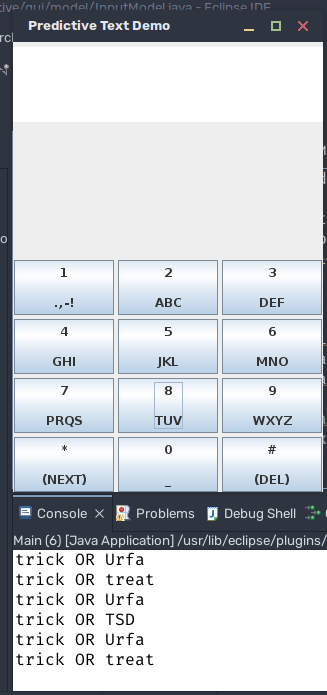

# Quiz 2 Report - Object Oriented Programming

## Intro, setup, and jobs

Topic: graphical user interface, predictive text

Members:

1. Muhammad Hidayat "Dayat" (05111940000131) #leader
2. Nouvelli Cornelia "Velli" (05111940000011)

We split the work in two parts:

- Velli works on problems 1 and 2
- Dayat works on problems 3 and 4, while improving some of Velli's previous works

Finally, the report is written by Dayat.

The ongoing and final source code can be seen in [this GitHub repository](https://github.com/return215/t9-demo).

## Solutions

### 1. Prototypes

The first prototype, `wordToSignature`, takes a word and transform it into a numerical signature. We assume that some symbols and numbers will be used. For example, the word `I'm` may generate the signature `416`.

The general method can be described in the following pseudocode:

```ts
function wordToSignature(word: string) : string {
    let temp = ""
    for (let c: char in word.toLowerCase()) {
        temp += letterToNumcode(c)
    }
    return temp
}
```


As for the conversion process (line 4), we evaluated three methods: `String` concatenation, `StringBuffer`, and additionally `StringBuilder`.

For the input, we use the following news article:
[Oracle sets its own JDK free, sort of, for a while](https://www.theregister.com/2021/09/16/oracle_jdk_free_license/)

The input has 94 lines, 883 words, and 5471 charactes (after manual intervention). First, we acquire the signatures that are given by the program `Words2SigProto`. Then, using it as input for the following executions, we perform 10 runs with each different implementations, and measure the time using the `time` command provided by the `bash` shell. The 'real' field in `time` is used for all the benchmarks.

Method | Average | Minimum | Maximum
----|----|----|---
`String` | 0.2284 | 0.210 | 0.256 
`StringBuffer` | 0.2008 | 0.189 | 0.224 
`StringBuilder` | 0.1915 | 0.179 | 0.209 

TL;DR: StringBuilder is better implementation for longer texts and multiple concatenations because it is **not** thread-safe.

Strings are immutable. When a string is made, it is written into the heap. If one tries to modify a string, Java will instead make a copy of it with the new modifications into memory. This impacts performance and memory usage, making String only effective for constant values and occasional concatenations.

Meanwhile, StringBuffer and StringBuilder are classes that can handle mutable strings as they modify strings internally and do not recreate new strings. Only when the result is needed then they will return a String.

The difference between the two is that StringBuffer is synchronized, preventing multiple thread calls on the class, whereas StringBuilder is not synchronized, allowing multiple threads to process the string it contains at the same time. Safety wise, StringBuffer is thread safe, StringBuilder is not. Due to this negligence on safety, performance can be gained on StringBuilder's side, making it our choice for the following implementations.

The second prototype, `signatureToWords`, is inefficient because it needs to load the dictionary file _every time_ the function is _called_. The solution is to move the loading of the dictionary file somewhere else, and then access it from there. It is the approach we use to optimize problems 2 and 3.

### 2. Dictionary with ArrayList

Class: `predictive.dictionary.DictionaryList`

The method `signatureToWords` is rewritten to access the dictionary that has been loaded to memory on the instance of the class. Since it is using a sorted list, it can be accessed efficiently using binary search. Implementation notes can be found in the source.

### 3. Dictionary using HashMap and Tree

Class: `predictive.dictionary.DictionaryMap`

We choose `HashMap` from the Java Collections API due to its simplicity in its implemetation. The map implementation is even simpler, using `String` as keys and `Set<String>` as a container for multiple unique values.

Unfortunately, we are unable to implement dictionary using tree within the given time.

Performance benchmarks using the same data set gives the following results.

| Implementation | Average   | Minimum  | Maximum  |
| -------------- | --------- | -------- | -------- |
| Prototype      | 2:19.3473 | 2:08.483 | 2:38.044 |
| List           | 0:01.4338 | 0:01.407 | 0:01.477 |
| Map            | 0:01.5557 | 0:01.462 | 0:01.835 |

It can be seen that the list implementation is faster due to its effective searching and initialization.

### 4. Graphical User Interface

Implemented:

- basic T9 functionality
- `*` to cycle words
- `#` as backspace
- `?` signs for unknown word (signature doesn't match any word)
- backspaces still allows previous inputs to be modified/cycled through

Known issue:

Input text does not show in `TextArea`, falls back to `stdout` logging.

The GUI implementation may not fully conform to MVC, since the model is not used in the controller, bur rather in the view.



## Declarations

- Muhammad Hidayat
  
- Nouvelli Cornelia
  

